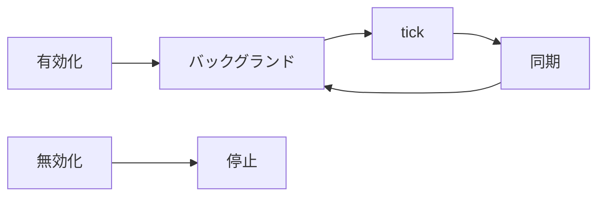

# Cogsworth

/cogsworth $ARGUMENTS

## 概要

このコマンドは Gemini 議事録を `refs` に同期する Cogsworth の有効化と無効化を行う。手順の正本は本ファイルで、`CLAUDE.md` の Cogsworth は概要のみを載せる。引数 `$1` が `off` のとき無効化し、未指定または `on` のとき有効化する。



## 仕組み

Cogsworth は Shell ツールで `loop.py` をバックグランド起動し、stdout の tick 行を `notify_on_output` で監視して Agent を起動する。`loop.py` は設定された曜日・時間帯・分のスケジュールに従い `AGENT_LOOP_TICK_COGSWORTH` を出力する。マッチのたびに Agent が同期し、結果を短く報告する。手元の Terminal で `loop.py` を動かしても Agent には届かない。

| 項目 | 値 |
| :-- | :-- |
| ループ | `~/activecore/.claude/commands/script/loop.py` |
| 時間帯の環境変数 | `COGSWORTH_START_HOUR` / `COGSWORTH_END_HOUR` |

## 無効化

タイトル `Cogsworth` のバックグランドシェルを停止する。`pgrep -fl "activecore/.claude/commands/script/loop.py"` でプロセスが残っていればその旨を伝える。シェルもプロセスも見つからなければ、既に停止している旨を伝える。

## 有効化

有効化は既存ループの停止、ループの起動、同期の実行からなる。毎回ループを再起動する。タイトル `Cogsworth` のバックグランドシェルを停止し、`pkill -f "activecore/.claude/commands/script/loop.py"` で残存プロセスがあれば終了する。その後 Shell ツールで `loop.py` を起動する。ループ起動後は直後に同期を 1 回実行し、以降は tick 通知時のみ同期する。

### ループ起動

Shell ツールでは `block_until_ms` を `0` にし、`notify_on_output` をオブジェクト（`pattern` と `reason`）で渡す。文字列だけでは通知が動かない。

```json
{
  "command": "cd ~/activecore && ~/activecore/.claude/commands/script/loop.py",
  "description": "Start Cogsworth loop with tick monitoring",
  "block_until_ms": 0,
  "notify_on_output": {
    "pattern": "AGENT_LOOP_TICK_COGSWORTH",
    "reason": "Cogsworth tick"
  }
}
```

| 設定 | 値 |
| :-- | :-- |
| `block_until_ms` | `0` |
| `notify_on_output.pattern` | `AGENT_LOOP_TICK_COGSWORTH` |

### 同期手順

同期はカレンダー取得、未登録の洗い出し、登録の 3 段階で行う。

カレンダーは Google Calendar MCP の `list_events` で取得する。

| パラメータ | 値 |
| :-- | :-- |
| `calendarId` | `y.nakamura@activecore.jp` |
| `startTime` | 過去 `7` 日（JST `0:00` 基準） |
| `endTime` | 現在時刻の `30` 分以上前（終了済みと猶予） |
| `timeZone` | `Asia/Tokyo` |
| `pageSize` | `100` |

未登録の洗い出しでは、`activecore query` の `source` から doc ID を集め、`list_events` の添付で `title` が `Gemini によるメモ` の doc と突合する。`refs` にない doc ID が未登録である。

各未登録件は次の順で登録する。Drive MCP の `read_file_content` で本文を取得し、`~/activecore/tmp/cogsworth_<doc_id>.txt` に保存する。`activecore tag infer --title "<イベント名>"` でタグを推定し、推定できなければ推測せずユーザーに確認する。`save` では `--content-file` が必須で、パスを末尾の positional 引数として渡す形式は使えない。

```bash
~/activecore/bin/activecore save \
  --title "<イベント名>" \
  --source "https://docs.google.com/document/d/<doc_id>/edit" \
  --content-file ~/activecore/tmp/cogsworth_<doc_id>.txt \
  --tag <タグ> \
  --require-tag
```

### tick 通知時

`AGENT_LOOP_TICK_COGSWORTH` または「Cogsworth tick」通知を受けたら同期だけを実行し、新規件数を短く報告する。同一 tick で通知が複数回来ても同期は 1 回で足りる。tick 処理ではループを再起動しない。

## トラブルシュート

| 症状 | 対処 |
| :-- | :-- |
| tick 時刻に同期されない | バックグランドシェルが終了している可能性がある。`pgrep` で確認し `/cogsworth` で再起動する |
| tick は出るが Agent が動かない | `notify_on_output` が未設定か形式が不正である。Shell 起動時の JSON を修正する |
| Terminal にループが見えない | Cursor のバックグランドシェルは Terminal タブに表示されない。通常の挙動である |

## 禁止事項

`nohup`、pid ファイル、ラッパーシェルによる常駐化は使わない。tick 時にループを再起動しない。タグ推定に失敗したまま推測で `save` しない。
