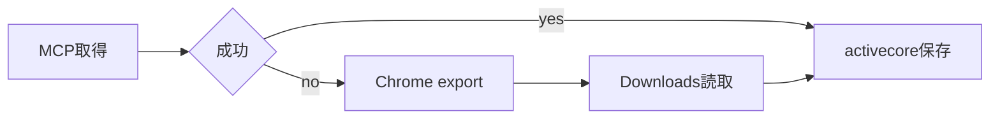

# Google Drive

activecore が Google Doc / Slide の本文を必要とするとき、まず Google Drive MCP の `read_file_content` で取得する。認証エラーなどで MCP が使えない場合は、ログイン済み Chrome が同じ Google アカウントで Doc を開ける前提で、ブラウザ経由のテキスト export に切り替える。取得した本文は `~/activecore/bin/activecore save` に渡し、要約は CLI がバックグラウンドで生成する。

## Trigger

次のいずれかに当てはまるとき、この Skill を適用する。

| 条件 | 例 |
| :-- | :-- |
| activecore 保存対象が Google Doc / Slide | ユーザーが `docs.google.com` の URL を共有 |
| MCP が本文を返せない | `Incompatible auth server` などの認証エラー |
| ローカルに同等の本文がない | Gemini メモ `.md` や export 済みファイルが未確認 |

ローカルに会議メモ（Gemini 由来の `.md` など）がある場合は、Chrome export より先にそちらを確認する。内容が足りなければ Doc から補う。

## Workflow

取得から保存までの流れは MCP 優先、Chrome export は fallback とする。



手順は次の 3 段階に分かれる。

1. URL から `fileId` を取り出し、可能なら `read_file_content` を呼ぶ。
2. MCP が使えないときは `scripts/fetch-gdoc.sh` で `.txt` をダウンロードし、Read ツールで本文を読む。
3. タイトルと `source` を正規化して `activecore save` を実行する。

## Source format

activecore の dedup は `source` の文字列一致に依存する。Google 系 URL は次の形式に揃える。

| 種別 | source |
| :-- | :-- |
| Google Doc | `https://docs.google.com/document/d/{fileId}/edit?usp=sharing` |
| Google Slide | `https://docs.google.com/presentation/d/{fileId}/edit?usp=sharing` |

`fileId` は共有 URL の `/d/{fileId}/` 部分から抽出する。Slide のテキスト export は Doc ほど安定しないため、MCP 再試行や PDF export など別手段を検討する。

## Chrome export

Chrome export は「ログイン済み Chrome の現タブで Doc を開き、同タブを `/export?format=txt` に遷移させてダウンロードする」方法である。リモートデバッグポートは不要で、AppleScript から `URL of active tab` を書き換えるだけで足りる。

スクリプトはリポジトリ内の `scripts/fetch-gdoc.sh` を使う。単一 Doc でも複数 Doc でも、引数に `fileId` を渡す。

```bash
.claude/skills/google-drive/scripts/fetch-gdoc.sh {fileId}
.claude/skills/google-drive/scripts/fetch-gdoc.sh id1 id2
```

各 `fileId` について、export 開始後に `~/Downloads` に落ちた `.txt` のパスを stdout に 1 行ずつ出力する。待機時間は環境変数 `OPEN_WAIT`（既定 `3` 秒）と `EXPORT_WAIT`（既定 `4` 秒）で調整できる。

手動で行う場合は、編集 URL で Doc を開いてから export URL へ遷移する。

```bash
FILE_ID="1OPjAhd5VuLO_rRKmJULRr1Q1WM6HfWXvriGCC7zZUu4"
EDIT_URL="https://docs.google.com/document/d/${FILE_ID}/edit"
EXPORT_URL="https://docs.google.com/document/d/${FILE_ID}/export?format=txt"

osascript -e "tell application \"Google Chrome\"
  activate
  if (count of windows) = 0 then make new window
  tell front window to set URL of active tab to \"${EDIT_URL}\"
end tell"
sleep 3
osascript -e "tell application \"Google Chrome\"
  tell front window to set URL of active tab to \"${EXPORT_URL}\"
end tell"
sleep 4
```

ダウンロード後は、export 開始時刻以降に更新された `.txt` のうち mtime が最新のファイルを本文として採用する。ファイル名に `(1)` が付く重複はよくある。

## Save command

本文ファイルを組み立て、activecore CLI で upsert する。同一 `source` の再 save は上書きされ、要約も再生成される。

```bash
TITLE="1on1（中村さん-正者） - 2026/06/12 文字起こし"
SOURCE="https://docs.google.com/document/d/${FILE_ID}/edit?usp=sharing"
BODY_FILE="/Users/yuji.nakamura/Downloads/example.txt"

{
  echo "# ${TITLE}"
  echo
  echo "source: ${SOURCE}"
  echo
  cat "$BODY_FILE"
} > /tmp/activecore-gdoc-body.md

~/activecore/bin/activecore save \
  --title "$TITLE" \
  --source "$SOURCE" \
  --content-file /tmp/activecore-gdoc-body.md
```

タイトルは Doc 先頭行、ダウンロードファイル名、会議名のいずれかから推定する。推定に迷う場合はユーザーが付けたファイル名や URL コンテキストを優先する。

## Requirements

| 項目 | 内容 |
| :-- | :-- |
| OS | macOS |
| ブラウザ | Google Chrome（対象 Google アカウントでログイン済み） |
| 権限 | 対象 Doc / Slide の閲覧権限 |
| 配置 | activecore リポジトリ内の `bin/activecore` が実行可能 |

## Troubleshooting

| 症状 | 対処 |
| :-- | :-- |
| ダウンロードが HTML（ログイン画面） | Chrome で該当アカウントにログインしてから再実行 |
| `.txt` が見つからない | `EXPORT_WAIT` を延ばす。Downloads 内の最新 mtime を確認 |
| ファイル名が `...(1).txt` | export 開始時刻以降の最新 `.txt` を採用 |
| MCP が再び使える | MCP を優先し、Chrome export は fallback のまま維持 |
| ローカルに Gemini メモがある | `Desktop/fde/fde-work/` などを grep し、本文が揃っていれば Doc 取得を省略 |

## Checklist

保存前に次を確認する。

| 観点 | 確認内容 |
| :-- | :-- |
| fileId | URL から正しく抽出したか |
| source | activecore 規定の URL 形式か |
| 本文 | ログイン HTML ではなく Doc 本文か |
| タイトル | 後から `query` で見つけやすい名称か |
| upsert | 同一 URL の再 save で意図どおり上書きするか |
