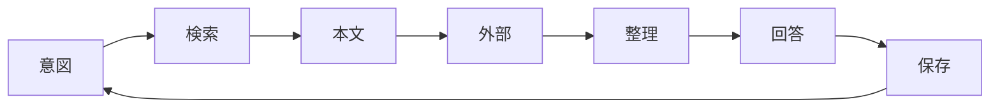

# activecore

会議・チャット・ドキュメントなどの文脈を AI エージェントに渡すワークスペース。SQLite の `refs` にタイトル・要約・本文キャッシュ・`source`・タグを保持する。`save` で本文をキャッシュし、以後は `get` で読む。正本は `source` 側にある。

## 概要

`refs` は資料の索引兼ローカルキャッシュである。`query` で候補を絞り、関連がありそうなものは `get` で本文まで読む。`content` が空のレコードは `source` から取り直して `save` する。タグの定義は `schema.sql` が正本で、`--tag` 未指定時は title から推定する（`tag infer` で確認できる）。`summary` が `(生成中)` なら要約ジョブが動いている。同一 `source` への再 `save` は upsert される。

```
activecore/
  CLAUDE.md
  schema.sql          # テーブル定義・タグ seed（refs.sqlite とは別物）
  bin/activecore
  .cursor/hooks.json   # Lumiere（議事録同期）hook
  db/refs.sqlite      # Git 管理外
  tmp/                # 要約処理（save 時に tmp/{id}.md → summarize → 削除）
```

CLI は `activecore --help` を参照する。`list` は `query` の alias。タグの変更は `tag add` / `remove` / `set`。

## 業務プロセス

各ターンは意図、検索、本文、外部補完、整理、回答、保存の 7 段階を回す。refs を再検索する前に、会話履歴と取得済み本文を使い回す。



Agent はメタデータ登録・本文キャッシュ・タグ付与・要約ジョブの起動まで行い、要約の生成そのものは行わない。判断と操作は次の原則に従う。

| 項目 | 内容 |
| :-- | :-- |
| 先に検索 | 回答・判断・実装の前に refs を検索する |
| 自動保存 | 参照しうる資料と会話で得た新情報は、頼まれなくても `save` する |
| 文脈の再利用 | 同一会話内の取得済み本文を使い回し、不要な再 fetch を避ける |
| 不確実性の分離 | 合意・進行中・未確認を混同しない |
| 根拠の明示 | 議事録・課題・予定など、出典を示す |
| 推測の禁止 | refs・Calendar・Backlog を見ずに断定しない |

意図の段階では、フォローアップか新規トピックかを見極める。検索ではクライアント名・プロジェクト名・機能名・課題キー・人名など、文脈から複数パターンを試す。ヒットしなければキーワードを分割して繰り返す。本文は `get <id>` で取る。要約だけでは、論点の有無や決定事項の突合はできない。

```bash
~/activecore/bin/activecore query <キーワード>
~/activecore/bin/activecore query --tag トリプルエス
~/activecore/bin/activecore query --limit 10
```

refs に無い情報は外部ソースで補う。並列に取れるものはまとめて実行する。

| 種別 | ソース | 操作 |
| :-- | :-- | :-- |
| 予定・次回MTG | Google Calendar | `search_events` / `list_events` |
| 課題・コメント | Backlog | `get_issues` / `get_issue_comments` |
| タスク・期限 | Linear | `list_issues` |
| リアルタイム文書 | Google Drive MCP | `read_file_content` |

複数ソースを突合して答える。事実と推測は分け、出典のない断定はしない。

## 参照情報

資料を `save` するとき、`--source` の形式は種別ごとに揃える。dedup のため、表のとおり書く。初回 save か内容の更新時だけ fetch し、以降は `get` を使う。本文は一時ファイルに書いてから `save` する。`--require-tag` でタグを推定できない場合はユーザーに確認する。

| 種別 | ソース | 操作 |
| :-- | :-- | :-- |
| Backlog | `https://{space}.backlog.com/view/{ISSUE_KEY}` | `get_issue` / `get_issue_comments` |
| Slack | permalink URL | `slack_read_thread` / `slack_read_channel` |
| Google Doc / Slide | `https://docs.google.com/.../d/{id}/edit` | `read_file_content` |
| Notion | `https://www.notion.so/{pageId}` | Notion MCP |
| ローカルファイル | 絶対パス | ファイル read |

終了済みカレンダーイベントに付く Gemini 議事録（添付 `title`: `Gemini によるメモ`）は、Calendar と Drive MCP 経由で自動登録する。`list_events`（`calendarId`: `y.nakamura@activecore.jp`、過去 7 日、終了 30 分以上前）で対象を洗い出し、未登録の doc ID だけ `read_file_content` して `save --require-tag` する。

```bash
~/activecore/bin/activecore save \
  --title "$summary" \
  --source "https://docs.google.com/document/d/{docId}/edit" \
  --content-file /tmp/activecore-meeting-{docId}.md \
  --require-tag
```

定期実行は Cursor の `stop` hook が担う（平日 10:00–19:30、毎時 :15 / :45）。**デフォルトは off** で、`/lumiere on` または `/lumiere` で有効化した会話のみ対象。Agent 終了後、次のティック時刻まで待って `AGENT_LOOP_TICK_meeting_notes_sync` で再開する。時間外は次の平日 10:15 まで待って followup する（ループ上限なし）。`/lumiere off` で停止。
