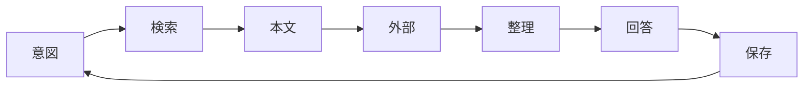
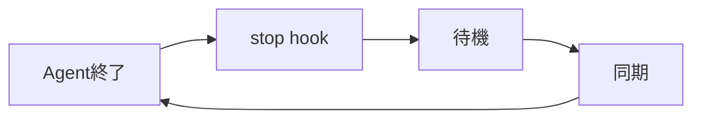

# activecore

会議・チャット・ドキュメントの文脈を Agent に渡すワークスペース。SQLite の `refs` にタイトル・要約・本文・`source`・タグを保持し、正本は `source` 側にある。`save` でキャッシュし、以後は `get` で読む。

## 概要

`refs` は索引兼キャッシュである。`query` で絞り、`get` で本文まで取る。`content` が空なら `source` から取り直して `save` する。タグは `schema.sql` が正本で、未指定時は title から推定する（`tag infer` で確認できる）。`summary` が `(生成中)` なら要約ジョブが動いている。同一 `source` への再 `save` は upsert される。

```
activecore/
  CLAUDE.md
  schema.sql
  bin/activecore
  .cursor/hooks.json
  .cursor/hooks/lumiere.py
  db/refs.sqlite
  tmp/
```

CLI は `activecore --help`。`list` は `query` の alias。タグ操作は `tag add` / `remove` / `set`。

## 業務プロセス

各ターンは意図、検索、本文、外部補完、整理、回答、保存の `7` 段階を回す。refs を再検索する前に、会話履歴と取得済み本文を使い回す。



Agent はメタデータ登録・本文キャッシュ・タグ付与・要約ジョブの起動まで行い、要約の生成そのものは行わない。

| 原則 | 内容 |
| :-- | :-- |
| 先に検索 | 回答・判断・実装の前に refs を検索する |
| 自動保存 | 参照しうる資料と会話で得た新情報は、頼まれなくても `save` する |
| 文脈の再利用 | 同一会話内の取得済み本文を使い回し、不要な再 fetch を避ける |
| 不確実性の分離 | 合意・進行中・未確認を混同しない |
| 根拠の明示 | 議事録・課題・予定など、出典を示す |
| 推測の禁止 | refs・Calendar・Backlog を見ずに断定しない |

検索はクライアント名・プロジェクト名・機能名・課題キー・人名など、文脈から複数パターンを試す。ヒットしなければキーワードを分割して繰り返す。本文は `get <id>` で取り、要約だけでは論点や決定事項の突合はできない。refs に無い情報は外部ソースで補い、並列に取れるものはまとめて実行する。

| 種別 | ソース | 操作 |
| :-- | :-- | :-- |
| 予定 | Google Calendar | `search_events` / `list_events` |
| 課題 | Backlog | `get_issues` / `get_issue_comments` |
| タスク | Linear | `list_issues` |
| 文書 | Google Drive MCP | `read_file_content` |

```bash
~/activecore/bin/activecore query <キーワード>
~/activecore/bin/activecore query --tag トリプルエス
~/activecore/bin/activecore query --limit 10
```

## 参照情報

資料を `save` するとき、`--source` は種別ごとに表の形式で書く（dedup のため）。初回 save か更新時だけ fetch し、以降は `get` を使う。本文は一時ファイルに書いてから `save` する。`--require-tag` でタグを推定できない場合はユーザーに確認する。

| 種別 | source | fetch |
| :-- | :-- | :-- |
| Backlog | `https://{space}.backlog.com/view/{ISSUE_KEY}` | `get_issue` / `get_issue_comments` |
| Slack | permalink URL | `slack_read_thread` / `slack_read_channel` |
| Google Doc | `https://docs.google.com/.../d/{id}/edit` | `read_file_content` |
| Notion | `https://www.notion.so/{pageId}` | Notion MCP |
| ローカル | 絶対パス | ファイル read |

## Lumiere

終了済みカレンダーイベントの Gemini 議事録を `refs` に登録する。Cursor hook が同期を担い、`/lumiere` で有効化した会話でのみ動く。初期状態は off。状態は `tmp/lumiere.json`、ログは `tmp/lumiere.log` に書く。

### 同期

`AGENT_LOOP_TICK_meeting_notes_sync` を受け取ったら、未登録分だけ save する。

| 段階 | 操作 |
| :-- | :-- |
| 対象 | Calendar `list_events`（`y.nakamura@activecore.jp`、過去 `7` 日、終了 `30` 分以上前） |
| フィルタ | 添付 `title` が `Gemini によるメモ` の doc ID |
| 登録 | Drive `read_file_content` → 一時ファイル → `save --require-tag`（source は参照情報の Google Doc 形式） |

タグ推定に失敗したら推測せず、ユーザーに確認する。

### スケジュール

平日 `10:00` から `19:30`、毎時 `:15` と `:45` に同期する。Agent 終了後は次のティックまで followup し、時間外は翌平日 `10:15` まで待つ。ループ上限はない。



### 制御

会話単位で on / off を切り替える。コマンドのみ送信した場合は Agent を起動せず、確認メッセージだけ表示する。有効化直後は次の Agent 終了時に即時同期する。

| 操作 | コマンド |
| :-- | :-- |
| 有効化 | `/lumiere` または `/lumiere on` |
| 無効化 | `/lumiere off` |
