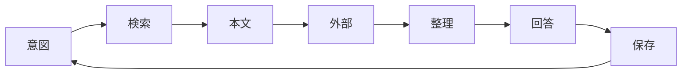
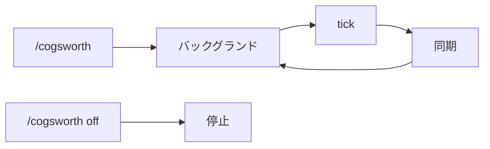

# activecore

## Overview

activecore は会議・チャット・ドキュメントの文脈を Agent に渡すためのワークスペースである。SQLite の Lumiere（ `db/lumiere.sqlite` ）に資料をキャッシュし、共通語彙で検索と分類をそろえる。資料の正本は常に `source` 側（Backlog URL、Google Doc URL など）にあり、Lumiere は索引とローカルコピーを保持する。

Lumiere のスキーマと CLI の詳細は [docs/lumiere.md](./docs/lumiere.md) にまとめている。

`reference` テーブルが資料の索引兼キャッシュである。`query` で絞り込み、`get` で本文まで取る。`content` が空のときは `source` から取り直して `save` する。用語の正本は `terms` テーブル群（共通語彙）で、save 時に title から自動推定する。`summary` が `(生成中)` のときは要約ジョブが動いている。同一 `source` への再 `save` は upsert される。

| table | role |
| :-- | :-- |
| `reference` | 資料の索引・本文キャッシュ |
| `terms` | 共通語彙（client / meeting / person / project / process / team / system / term） |
| `term_aliases` | 別名・タイトルマッチ用パターン |
| `reference_terms` | 資料と用語の紐付け |
| `term_relations` | 用語間の関係（works_for, part_of, uses など） |

`save` の直後、バックグラウンドで要約ジョブ（ `summarize` ）が走る。1 回の agent 呼び出しで要約と共通語彙の更新をまとめて行う。本文からの語彙抽出は `term learn` を手動で実行する。

```
activecore/
  CLAUDE.md
  docs/lumiere.md
  schema.sql
  bin/activecore
  .claude/commands/cogsworth.md
  .claude/commands/script/
  db/lumiere.sqlite
  tmp/
```

## CLI reference

よく使う操作を次に示す。`list` は `query` の alias である。

| operation | command |
| :-- | :-- |
| 保存 | `activecore save --title T --source URL --content-file PATH [--term NAME ...] [--require-term]` |
| 本文 | `activecore get ID` |
| 検索 | `activecore query [KEYWORD ...]` / `query --term NAME ...` |
| 用語推定 | `activecore term infer "タイトルや文面"` |
| 用語一覧 | `activecore term list [--category CAT]` |
| 用語詳細 | `activecore term query NAME`（完全一致で詳細表示） |
| 用語追加 | `activecore term add --name N --category CAT [--alias A ...]` |
| 語彙学習 | `activecore term learn ID`（手動・バッチ用） |
| 資料の用語 | `activecore reference link list|add|remove|set ID --term NAME ...` |

## Agent workflow

各ターンは意図、検索、本文、外部補完、整理、回答、保存の 7 段階を回す。同一会話内で既に `get` した本文は使い回し、不要な再 fetch を避ける。



Agent はメタデータ登録・本文キャッシュ・用語付与・要約ジョブの起動まで行う。要約テキストの生成そのものはバックグラウンドジョブが担う。

| principle | detail |
| :-- | :-- |
| 先に検索 | 回答・判断・実装の前に reference を検索する |
| 自動保存 | 参照しうる資料と会話で得た新情報は、頼まれなくても `save` する |
| 文脈の再利用 | 同一会話内の取得済み本文を使い回す |
| 不確実性の分離 | 合意・進行中・未確認を混同しない |
| 根拠の明示 | 議事録・課題・予定など、出典を示す |
| 推測の禁止 | reference・Calendar・Backlog を見ずに断定しない |

検索では、クライアント名・会議名・プロジェクト名・課題キー・人名など、文脈から複数パターンを試す。`term infer` で拾える用語を確認してから `query --term` する。本文は `get <id>` で取る。要約だけでは論点や決定事項の突合はできない。

```bash
~/activecore/bin/activecore term infer "確定：トリプルエスさま定例"
~/activecore/bin/activecore term query トリプルエス
~/activecore/bin/activecore query --term トリプルエス
~/activecore/bin/activecore query 要件 HTML
~/activecore/bin/activecore query --limit 10
```

## Source formats

`save` するときの `--source` は種別ごとに次の形式で書く。形式をそろえると同一資料の重複登録を防げる。初回 save か更新時だけ外部から fetch し、以降は `get` を使う。本文は一時ファイルに書いてから `save` する。

`--require-term` を付けると、title からの用語推定に失敗した場合に save を止める。推定できないときは `term infer` の結果をユーザーに確認し、`--term` で明示してから save する。

| type | source format | fetch |
| :-- | :-- | :-- |
| Backlog | `https://{space}.backlog.com/view/{ISSUE_KEY}` | `get_issue` / `get_issue_comments` |
| Slack | permalink URL | `slack_read_thread` / `slack_read_channel` |
| Google Doc | `https://docs.google.com/.../d/{id}/edit` | `read_file_content` |
| Notion | `https://www.notion.so/{pageId}` | Notion MCP |
| local | 絶対パス | ファイル read |

## Cogsworth

Cogsworth は、終了済みカレンダーイベントに添付された Gemini 議事録を `reference` に登録する仕組みである。同期手順の正本は `.claude/commands/cogsworth.md` である。定期実行はバックグランドシェルが `AGENT_LOOP_TICK_COGSWORTH` を出力し、tick ごとに Agent が同期する。

### Sync steps

tick を受け取ったら、未登録分だけ save する。

| step | action |
| :-- | :-- |
| 対象 | Calendar `list_events`（ `y.nakamura@activecore.jp` 、過去 7 日、終了 30 分以上前） |
| フィルタ | 添付 `title` が `Gemini によるメモ` の doc ID |
| 登録 | Drive `read_file_content` → `tmp/cogsworth_<doc_id>.txt` → `save --content-file ... --require-term` |

`--title` にイベント名を渡すと用語は自動推定される。推定できない場合だけ `term infer` で確認し、`--term` を付ける。

### Operations

`/cogsworth` または `/cogsworth on` でバックグランドループを起動し、直後に同期を 1 回実行する。その後は平日、各時 15 分・45 分（ `Asia/Tokyo` 、既定は 10 時〜19 時）に tick が出て、同期手順が繰り返される。`/cogsworth off` でループを停止する。


