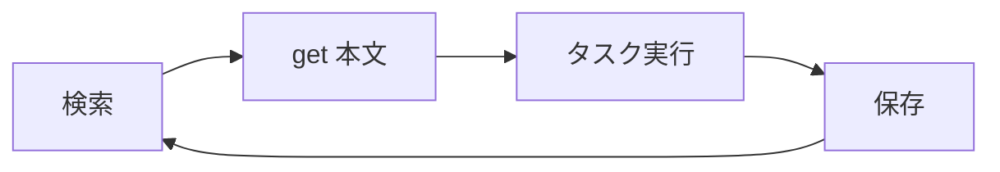

# activecore

会議・チャット・ドキュメントなどの文脈を AI エージェントに渡し、日々の作業を速く正確に進めるためのワークスペース。SQLite 上の参照資料インデックス `refs` が中核で、作業前に関連情報を検索し、共有された資料は指示がなくても保存する。

## Purpose

`refs` にはタイトル・要約・本文キャッシュ・取得元 URL（またはローカルパス）・タグを保持する。本文は `save` 時に DB へキャッシュし、以後は `get` で即読する。正本は引き続き `source` 側。要約は保存時にバックグラウンドで Cursor CLI が生成するため、保存を担当する Agent は要約完了を待たない。

## Agent behavior

Agent は次の 2 点を必ず守る。

### Query first

タスク着手前、または判断・実装・回答の前に、関連資料を検索してコンテキストに載せる。

```bash
~/activecore/bin/activecore query <タスクに関連するキーワード>
~/activecore/bin/activecore query --tag トリプルエス
~/activecore/bin/activecore list --limit 10   # 直近の資料を確認する場合
```

キーワードはクライアント名・プロジェクト名・機能名・課題キーなど、文脈から推定する。ヒットした候補のうち関連度が高いものは `activecore get <id>` で本文を取る。`content` が無い旧レコードだけ `source` から fetch し、再 save する。

### Save automatically

ユーザーが「保存して」と言わなくても、後の作業で参照しうる資料はすべて保存対象とする。Backlog 課題・Slack スレッド、Google Doc / Slide、Notion ページ、ローカル PDF / HTML、会議メモや仕様・決定事項などが該当する。保存 Agent の役割はメタデータ登録・本文キャッシュ・タグ付与・要約ジョブの起動までで、要約の生成自体は行わない。クライアント・プロジェクト・チームが分かる場合は `--tag` を付ける。

## Data model

| パス | 内容 |
| :-- | :-- |
| `db/refs.sqlite` | メタデータ・本文キャッシュ・タグ |
| `bin/activecore` | CLI スクリプト |
| `tmp/` | 要約用一時ファイル（完了後に削除） |

本文は `save` 時にキャッシュする。参照の既定経路は `get`。鮮度が必要なときだけ `source` から再取得して再 save する。

## Layout

```
activecore/
  CLAUDE.md          # 運用ルール・使い方
  schema.sql         # DB テーブル定義
  bin/activecore     # CLI（ディレクトリではなく実行ファイル 1 本）
  db/refs.sqlite     # 実データ（実行時に自動生成）
  tmp/               # 要約処理の一時置き場
```

### bin/activecore

`bin/activecore/` というフォルダではなく、`bin/` 配下の bash スクリプト 1 本である。

| サブコマンド | 役割 |
| :-- | :-- |
| `save` | メタデータと本文を SQLite に upsert し、バックグラウンド要約を起動。`--tag` 可 |
| `summarize` | Cursor CLI で 200 字要約を生成 |
| `get` | キャッシュ本文を出力 |
| `query` | `title` / `summary` / `content` をキーワード検索（AND）。`--tag` 可 |
| `list` | 直近の保存資料一覧。`--tag` 可 |
| `tag` | タグ一覧・付与・削除・置換（`list` / `add` / `remove` / `set`） |

### schema.sql

`schema.sql` は DB ファイル `refs.sqlite` とは別物である。前者はテーブル定義の設計図で Git 管理する。後者は実行時に生成されるデータファイルで Git 管理しない。

置き場所はプロジェクトによって異なる。小規模プロジェクトではルートに置くことが多い。`db/schema.sql` のように DB 関連を `db/` にまとめる構成もある。重要なのは、設計図（ `schema.sql` ）とデータ（ `refs.sqlite` ）を混同しないことである。

### tmp

要約処理専用の一時置き場である。`save` 時に `--content-file` のコピーを `tmp/{id}.md` に置き、バックグラウンドの `summarize` が Cursor CLI（ `agent -p` ）に渡して要約する。完了後 `tmp/{id}.md` は削除する。`tmp/summarize.log` に要約ジョブのログが残る。本文そのものは DB の `content` に残る。

## CLI

```bash
# 保存（upsert。同一 source は上書き。本文もキャッシュ）
~/activecore/bin/activecore save \
  --title "タイトル" \
  --source "URL or 絶対パス" \
  --content-file /tmp/body.md \
  --tag トリプルエス \
  --tag FDE

# キャッシュ本文
~/activecore/bin/activecore get <id>

# キーワード検索（AND 条件）+ タグ絞り込み
~/activecore/bin/activecore query キーワード1 キーワード2
~/activecore/bin/activecore query --tag トリプルエス 要件

# 直近一覧
~/activecore/bin/activecore list --limit 10
~/activecore/bin/activecore list --tag FDE

# タグ
~/activecore/bin/activecore tag list
~/activecore/bin/activecore tag add <id> --tag 資生堂 --tag マーケOps
~/activecore/bin/activecore tag remove <id> --tag 資生堂
~/activecore/bin/activecore tag set <id> --tag トリプルエス --tag PoC型化
```

## Tags

タグは固定 enum。未登録名は拒否する。追加が必要なら `schema.sql` の seed を更新する。

| カテゴリ | タグ |
| :-- | :-- |
| クライアント系 | 阪急交通社, トリプルエス, SABON, キナリ, 資生堂, イオンペット |
| プロジェクト系 | PoC型化, 品質管理エージェント |
| チーム系 | マーケOps, FDE |

## Save workflow

保存は source の正規化、本文取得、CLI 実行の 3 段階で行う。

### Source format

dedup のため `--source` は次の形式に統一する。

| 種別 | source 形式 |
| :-- | :-- |
| Backlog | `https://{space}.backlog.com/view/{ISSUE_KEY}` |
| Slack | permalink URL |
| Google Doc | `https://docs.google.com/document/d/{fileId}/...` |
| Google Slide | `https://docs.google.com/presentation/d/{fileId}/...` |
| Notion | `https://www.notion.so/{pageId}` |
| ローカルファイル | 絶対パス（例: `/Users/.../file.pdf` ） |

### Content fetch

| 種別 | 取得方法 |
| :-- | :-- |
| Backlog 課題 | `get_issue` , `get_issue_comments` |
| Slack | `slack_read_thread` / `slack_read_channel` |
| Google Doc / Slide | `read_file_content` |
| Notion | Notion MCP |
| ローカル PDF / HTML | ファイル read |

初回 save または鮮度更新のときだけ fetch する。以降の参照は `get`。

### Run save

本文を一時ファイルに書き、CLI で登録する。分かる範囲でタグを付ける。

```bash
~/activecore/bin/activecore save \
  --title "課題タイトルまたはファイル名" \
  --source "https://..." \
  --content-file /tmp/activecore-body.md \
  --tag トリプルエス \
  --tag FDE
```

戻り値は uuid（ `id` ）。本文は DB にキャッシュされ、要約はバックグラウンドで自動起動（ `agent -p --model auto` ）される。保存 Agent の作業はここで終了する。

## Query workflow

参照は query で候補を絞り、`get` で本文を載せてからタスクを実行する。`content` が無い場合だけ `source` から fetch する。新しい情報が出たら save（必要なら `--tag`）して次回以降の検索に備える。



query 結果をファイルに書き出して Agent に渡す例:

```bash
~/activecore/bin/activecore query トリプルエス > /tmp/ref-context.md
~/activecore/bin/activecore get <id> > /tmp/ref-body.md
```

## Schema

```sql
CREATE TABLE refs (
  id         TEXT PRIMARY KEY,
  title      TEXT NOT NULL,
  summary    TEXT,               -- 200字要約（NULL = 生成中）
  content    TEXT,               -- 本文キャッシュ
  source     TEXT NOT NULL UNIQUE,
  created_at TEXT NOT NULL,
  updated_at TEXT NOT NULL
);

CREATE TABLE tags (
  name     TEXT PRIMARY KEY,
  category TEXT NOT NULL CHECK (category IN ('client', 'project', 'team'))
);

CREATE TABLE ref_tags (
  ref_id TEXT NOT NULL,
  tag    TEXT NOT NULL,
  PRIMARY KEY (ref_id, tag)
);
```

## Notes

`summary` が `(生成中)` の場合、要約ジョブ実行中である。本文が必要なら `get` でキャッシュを読む。同じ `source` を再 save すると upsert され、本文・要約が更新される。`save` 時に `--tag` を付けるとタグは置換される。タグだけ変えるときは `tag add` / `remove` / `set`。要約ログは `tmp/summarize.log` を参照する。
