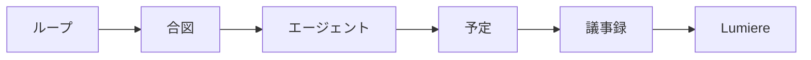
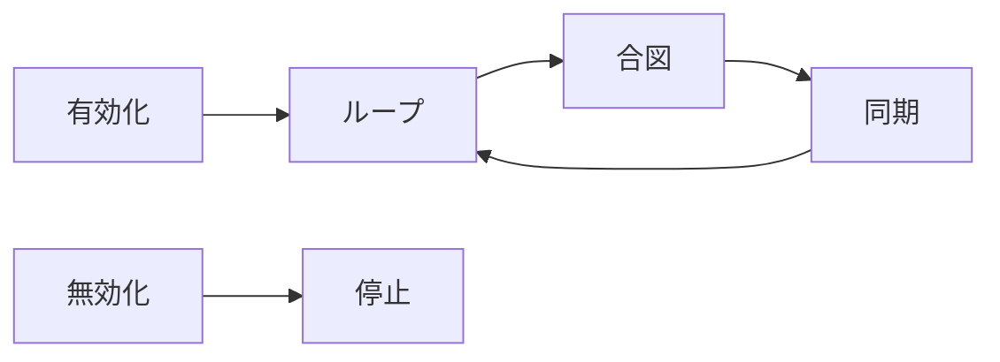

# Cogsworth

## Overview

Cogsworth は、終了したカレンダー予定に添付された Gemini 議事録を Lumiere の `reference` に取り込む仕組みである。会議のたびに手で保存しなくても、平日の日中に一定の間隔で取り込みが走る。議事録の正本は Google Doc 側にあり、Lumiere が持つのは本文のコピーと検索用の索引である。

このドキュメントは仕組みと運用を説明する。Agent が実行するコマンド手順は `.claude/commands/cogsworth.md` にある。

## Mechanism

Cogsworth は時計と実行者の 2 つに分かれる。バックグランドシェルで動く `loop.py` が決まった時刻に合図の行を標準出力へ出し、Shell ツールの `notify_on_output` がその行を検出して Agent を起動する。議事録を読んで登録するのは Agent であり、`loop.py` は時刻を知らせるだけで DB には触れない。

手元の Terminal で `loop.py` を動かしても Agent には届かない。通知は Shell ツールから起動したときだけ機能する。

## Schedule

合図は平日の日中に限って出る。時間帯は環境変数で変えられる。

| item | value |
| :-- | :-- |
| タイムゾーン | `Asia/Tokyo` |
| 曜日 | 月曜から金曜 |
| 開始時刻 | `COGSWORTH_START_HOUR` （既定は `10` ） |
| 終了時刻 | `COGSWORTH_END_HOUR` （既定は `19` ） |
| 分 | 毎時 `15` 分と `45` 分 |
| 合図の文字列 | `AGENT_LOOP_TICK_COGSWORTH` |

## Sync

同期は対象の取得、未登録の判定、登録の 3 段階で進む。すでに登録済みの議事録は読み直さない。

| step | action |
| :-- | :-- |
| 対象の取得 | Calendar の `list_events` で、過去 `7` 日のうち終了から `30` 分以上経った予定を取る |
| 未登録の判定 | 添付の `title` が `Gemini によるメモ` の doc ID を集め、`reference` の `source` と突き合わせる |
| 登録 | Drive の `read_file_content` で本文を取り、`tmp/` に書き出してから `save --require-term` で登録する |

用語は予定の名前から自動で推定する。推定できなかった場合は `--require-term` が登録を止めるので、`term infer` の結果をユーザーに確認し、`--term` で明示してから登録する。推測のまま登録しない。

## Operations

`/cogsworth` または `/cogsworth on` でループを起動し、その直後に同期を 1 回実行する。以降は合図を受け取るたびに同期が走る。`/cogsworth off` でループを停止する。有効化のたびにループは作り直すため、二重に動くことはない。

## Troubleshooting

よくある症状と対処を示す。

| symptom | action |
| :-- | :-- |
| 合図の時刻になっても同期されない | バックグランドシェルが終了している。`pgrep -fl loop.py` で確認し、`/cogsworth` で起動し直す |
| 合図は出るが Agent が動かない | `notify_on_output` の形式が正しくない。文字列ではなく `pattern` と `reason` を持つオブジェクトで渡す |
| Terminal にループが見えない | バックグランドシェルは Terminal タブに現れない。異常ではない |
