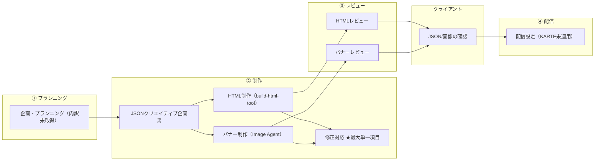

# トリプルS AS-IS フロー

出典: [NB クライアント×工程 マトリクス（AS-IS / 登り方 / TO-BE）](https://activecorehq.slack.com/files/U0438RB4V8T/F0BP74WBZKJ/nb_clientprocessmatrix.html)、[Opsコスト削減に向けた議論②](https://docs.google.com/document/d/1wAkwn5gz78ZgpZ6l2xvKxgsHr96RBD0wwsHJrcspq1k/edit)

**規模:** 60本/月（ナラマケ）  
**分解粒度:** プランニングの作業内訳は未取得（¥122,500/月）  
**AS-IS 時点:** 2026年8月現在（7月実績ベース）

---

## エージェント化レベル（Lv）定義

レベルは「人が何を残すか」で定義する。ツールの有無や精度ではなく、NB請求の構造に対応する。

| Lv | 定義 | 人が残す作業 | NB請求の扱い |
| :-- | :-- | :-- | :-- |
| **L0** | ツールなし・完全人手 | 全作業 | 本数×単価（満額） |
| **L1** | 支援ツールあり。人が GUI を操作し、人が判断する | 入力の運搬・起動・待機・出力確認・格納・次工程への連絡・品質採点 | 本数×単価（ほぼ満額） |
| **L2** | ジョブ化。AC がトリガーし成果物が所定の場所に自動配置 | 成果物のチェックのみ | 単価を大幅改定 |
| **L3** | チェーン化。前後工程が自動連結。完了判定は観点通過 | 観点通過の確認・例外対応 | 明細行を消す（例外のみ実費） |
| **L4** | 完全自動 | 例外のみ | 明細行なし |

トリプルS AS-IS は **L0〜L1 が中心**。修正対応（L0）が最大単一項目。HTML レビューは AG 実装済みだが運用は L1（AG 待ち）。

---

## フロー図

---

## 工程別サマリ

| 大工程 | 作業 | 担当 | ツール | Lv | 備考 |
| :-- | :-- | :-- | :-- | :-- | :-- |
| ① | プランニング | NB 永田 | NotebookLM（試行中） | L0 | 作業内訳未取得。NB に提出依頼中 |
| ② | HTML 制作 | NB 小松 | build-html-tool（Mastra） | L1 | 実効 ¥6,098/h |
| ② | バナー制作 | NB 浅倉・Ops | Image Agent（Mastra） | L1 | マニュアル 31 手順。品質採点と「主観で 1 つ選択」が人 |
| ② | 修正対応 | NB 藤川・浅倉 | — | L0 | ★最大単一項目。修正 59 本＞作成 49 本 |
| ③ | HTML レビュー | NB 田中 | HTML レビュー担当 AG（自動キック実装済） | L1 | 実効 ¥12,000/h。単価改定余地が最大。運用は AG 待ち |
| ③ | バナーレビュー | NB 浅倉 | チェックリスト採点（人） | L1 | 新ツールで調整範囲が逆に拡大 |
| ④ | 配信設定 | NB Ops | —（KARTE 未適用） | L0 | C-1 確定待ち。単価 ¥1,300 で不変 |
| ⑤ | 数値集計 | NB 田中 | —（AC 側 Skill あり未移管） | L0 | |
| ⑤ | レポート作成 | NB 永田 | —（AC 側 Skill あり未移管） | L0 | 2 回の定例資料対応 |
| ⑥ | タスク作成・進行管理 | NB 山上 | Backlog（手運用） | L0 | B-1 対象 |
| ⑥ | 制作ディレクション・窓口 | NB 山上 | — | L0 | B-1 対象 |
| ⑥ | 業務整理（分析・提案・改善） | NB 永田ほか | — | L0 | NB は別見積項目化を提案中 |

---

## 補足

- **修正前提の単価構造:** 修正 59 本 > 作成 49 本 → 全件修正が発生する前提で見積もられている
- **レビュー:** HTML レビュー AG は実装済み（到達可能 Lv は L3〜L4）だが、キック・確認は人が介在するため AS-IS は L1
- **プランニング:** 内訳提出後に L1 要素の有無を再評価する（現時点は L0 で記載）
